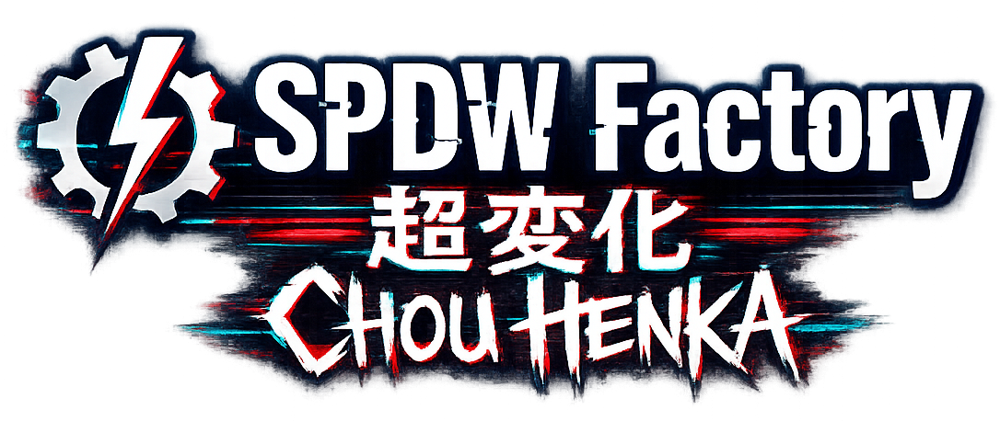

<!-- RSPDW_LOGO_PLACEHOLDER -->
<!-- CHOUHENKA_LOGO_PLACEHOLDER -->

# 🌌 RSPDW Chou Henka Project
### *Transmedia Omniverse Framework & Hardware Reclamation Protocol*

**"From the ashes, with a peremptory purpose."**  
*An open-source cybernetic initiative to reclaim legacy silicon and obsolete mobile nodes.*

<!-- SPDW_LOGO_PLACEHOLDER -->
<!-- FACTORY_LOGO_PLACEHOLDER -->

---

## 👁️ THE MANIFESTO

The **RSPDW Chou Henka Project** is an aggressive hardware reclamation initiative born from a singular, uncompromising necessity: to breathe high-frequency life back into legacy digital devices that have been systematically relegated to the role of paperweights, or treated as dusty relics of a nostalgic past—turned on for mere minutes by accident, and then forgotten.

We do not look at obsolete hardware with passive nostalgia; we look at it as an unpolished, isolated canvas. The project takes these forgotten architectural clusters and injects them with a modern, dark cyberpunk matrix (*"Megastructure Noir"*), turning outdated limitations into highly focused, tactical user terminals. 

---

## 🔮 THE MULTIMODAL PRISM ARCHITECTURE

The *Chou Henka Project* does not produce single, isolated applications. It operates as a Transmedia Framework (Prism Architecture). A single conceptual seed is fragmented and distributed through different, interconnected vectors:

*   **⚡ Mobile Terminal Apps & Emulators:** Low-level developer tools engineered to grant complete shell control directly on the handheld screen.
*   **📖 Core Documents & Literature:** Cyberspace narratives, system log files, and dark sci-fi architectural schematics framing the universe.
*   **🧩 Encrypted Enigmas & Web Interfaces:** Interactive sub-nets, netrunning logic gates, and web nodes used to decode hidden coordinates.
*   **🎵 Low-Frequency Audio / Music:** Atmospheric data streams designed to establish the mental frequencies of the operational sector.

---

## 🪐 THE SPDW UNIVERSE

The codebase, structural designs, and architectural components of this initiative are fundamentally bound to the transmedia sci-fi cosmos of the **"Sir PIPS DU WILSON"** light novel series. This narrative setting is a dark, psychological cyberpunk reality governed by a raw, primordial cosmic energy known as the **Rintrompo**, which frequently flows through the non-sense chaotic matrix of **Sbrobs**.

> ⚠️ **P.S. / Structural Disclaimer:** If you encounter erratic terminal prompts, system logs, or UI strings warning that a tool might *"put your handheld device into a high Rintromping state"*, do not panic. These are completely harmless meta-jokes, worldbuilding footnotes, and embedded fiction strings. They carry zero malicious execution threads and pose no actual threat to your physical hardware or host operating system. It is simply stupid, immersive lore.

---

## 📄 PROTOCOL LICENSE

> **MIT License**  
> Copyright (c) 2026 SPDW Factory / sirpipsduwilson  

Permission is hereby granted, free of charge, to any person obtaining a copy of this software and associated documentation files (the "Software"), to deal in the Software without restriction, including without limitation the rights to use, copy, modify, merge, publish, distribute, sublicense, and/or sell copies of the Software, and to permit persons to whom the Software is furnished to do so, subject to the following conditions:

The above copyright notice and this permission notice shall be included in all copies or substantial portions of the Software.

THE SOFTWARE IS PROVIDED "AS IS", WITHOUT WARRANTY OF ANY KIND, EXPRESS OR IMPLIED, INCLUDING BUT NOT LIMITED TO THE WARRANTIES OF MERCHANTABILITY, FITNESS FOR A PARTICULAR PURPOSE AND NONINFRINGEMENT. IN NO EVENT SHALL THE AUTHORS OR COPYRIGHT HOLDERS BE LIABLE FOR ANY CLAIM, DAMAGES OR OTHER LIABILITY, WHETHER IN AN ACTION OF CONTRACT, TORT OR OTHERWISE, ARISING FROM, OUT OF OR IN CONNECTION WITH THE SOFTWARE OR THE USE OR OTHER DEALINGS IN THE SOFTWARE.

---

## 🗂️ CONNECTED NODES & INFRASTRUCTURE

### 💻 CORE PC SUITE (Host Desktop Software)

| Repository Link | Core Purpose / Protocol Status | Description |
| :--- | :--- | :--- |
| **📁 Rt:Retrofw SyncHub HQ** | *(Coming Soon)* | **PC Suite for ecosystem management and remote device interaction via USB Gadget Network.** Essential host hub for rapid script injection and remote filesystem layout control. |

### 🎮 MACRO SECTOR: RS-97 (RetroFW 2.3 Ecosystem)

| Repository Link | Sub-Title Execution Hook | Operational Description |
| :--- | :--- | :--- |
| **[⚡ Rt:Terminal I.D.](https://github.com/SilverCrow2323/Rt-Terminal-I.D.)** | *Terminal Shell for Retrofw 2.3. Could be able to Rintromp your handled.* | Multi-session terminal emulator featuring raw cell-grid input, pixel-exact symmetric linear printing, and persistent JSON sequence serialization layers. |

### 🌐 GLOBAL INFRASTRUCTURE & DOCUMENTATION

| Repository Link | Target Domain | Module Specification |
| :--- | :--- | :--- |
| **📁 Core-Lore-Vault** | *(Coming Soon)* | Central documentation mainframe containing cryptographic data, layout worldbuilding schematics, and system event logs. |
| **🌐 Net-Nodes Gateway** | *(Coming Soon)* | Interactive simulated sub-nets, portal web matrix configurations, and remote cipher decoders. |

---

## ⚓ UPSTREAM ECOSYSTEM & REFERENCES

To fully interface with the underlying hardware, deployment frameworks, and legacy environments utilized by this project, refer to the official core components below:

### ⚙️ Operating Systems & Kernels
*   **[RetroFW Main Ecosystem](https://github.com/retrofw)** — The primary custom firmware platform hosting our active target architecture.
*   **[OpenDingux Release Network](https://github.com/OpenDingux)** — Legacy base ecosystem and architectural toolchains for MIPS-based dingux distributions.

### 📦 Compilation & Packaging Standards
*   **[OPK Specification & SquashFS Tools](https://github.com/retrofw/retrofw.github.io/wiki/App-Packages-(.opk))** — Official deployment guidelines for packaging compiled binaries into standalone OpenPackage (.opk) execution containers.
*   **[RetroFW Toolchain Mainframes](https://github.com/retrofw/toolchain)** — Embedded cross-compilation infrastructure for low-level JZ4760B target binaries.

---

<!-- MINORU_LOGO_PLACEHOLDER -->

### 👥 DEVELOPMENT CORE & SIGNATURES

**SPDW Factory** — Development  
**sirpipsduwilson** — Project Lead  

Part of **"SPDW"** — *Crossdimensional Underground Cyberpunk Entertainment Protocol*

With the participation of:  
**Minoru^7** — RI *(pain in the a**)* Protocol Integration Node  

---

**"From the ashes, with a peremptory purpose."**  
*SPDW Factory — Sector G Active*

